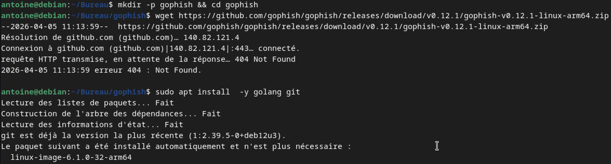
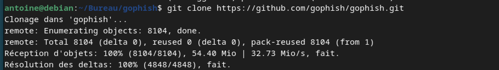
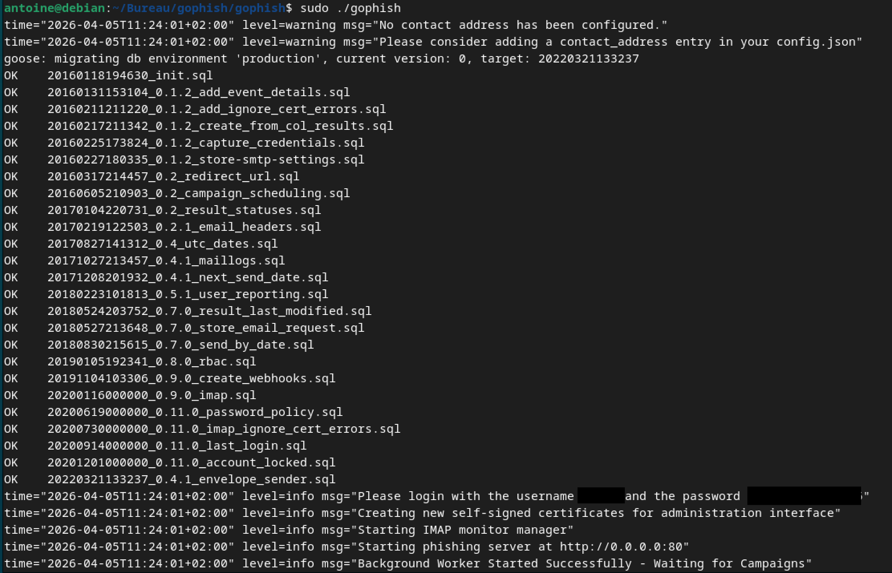
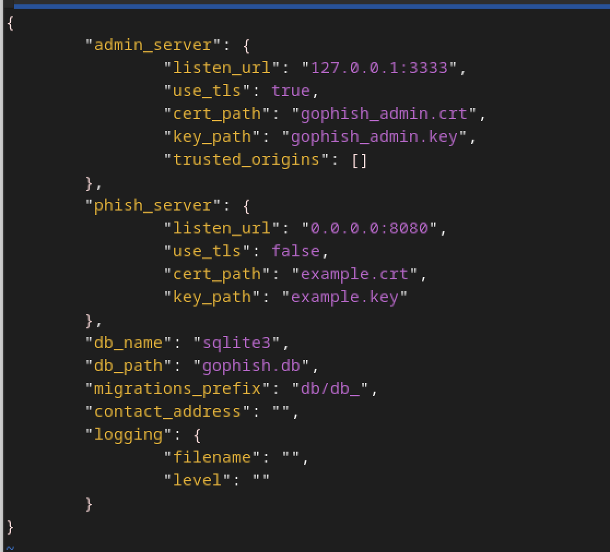
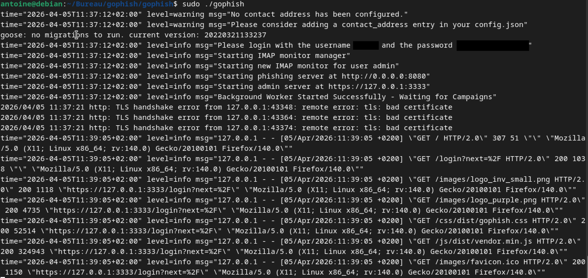
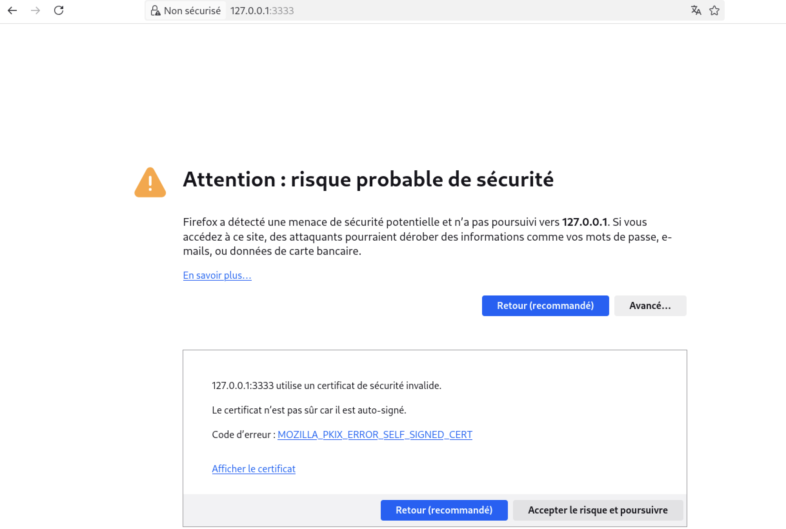
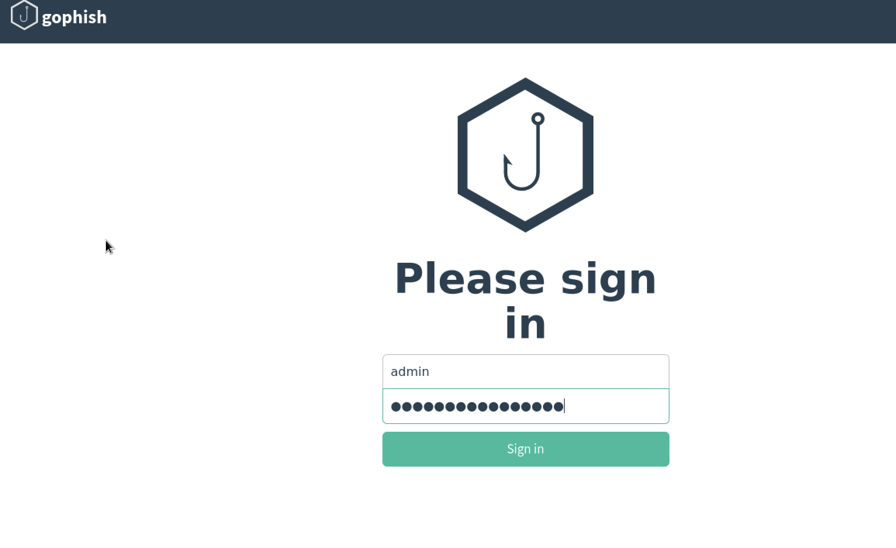
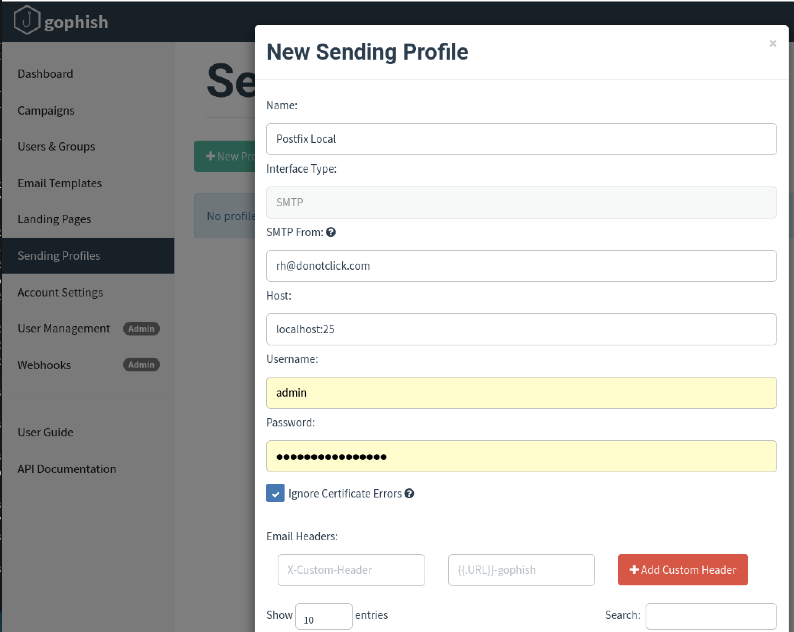
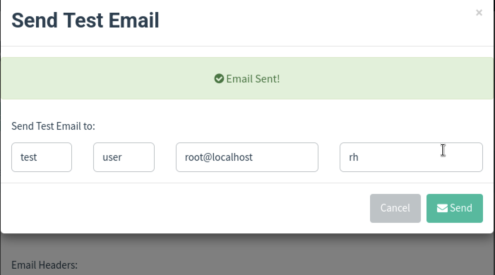
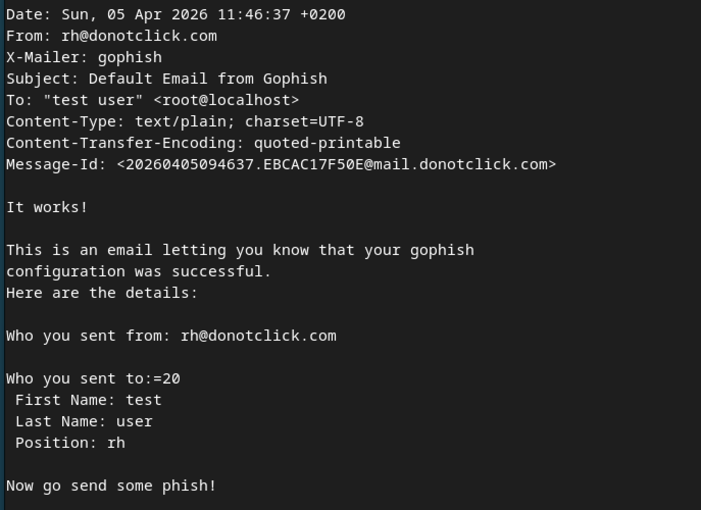

# 02 — Framework GoPhish


> Installation et configuration de GoPhish sur Debian 12 (ARM64).
> GoPhish orchestre les campagnes de phishing et se connecte à Postfix via `localhost:25`.

---

## Objectif

Disposer d'une interface de gestion de campagnes de phishing, connectée
au serveur Postfix configuré à l'étape précédente.

---

## 1. Installation

### 1.1 Contexte ARM64

La release officielle GoPhish v0.12.1 ne propose pas de binaire ARM64.
On compile depuis les sources, Go est requis uniquement pour cette étape.

### 1.2 Installer Go et Git

```bash
sudo apt install -y golang git
```


### 1.3 Créer le dossier et cloner le repo

```bash
mkdir -p ~/Bureau/gophish && cd ~/Bureau/gophish
git clone https://github.com/gophish/gophish.git
cd gophish
```



### 1.4 Compiler et rendre exécutable

```bash
go build .
chmod +x gophish
```

### 1.5 Premier lancement

```bash
sudo ./gophish
```

GoPhish affiche un mot de passe temporaire dans la console :

```
level=info msg="Please login with the username admin and the password <GENERATED_PASSWORD>"
level=info msg="Starting admin server at https://127.0.0.1:3333"
```



---

## 2. Résolution du conflit port 80

Au premier lancement, GoPhish peut afficher :

```
level=fatal msg="listen tcp 0.0.0.0:80: bind: address already in use"
```

Le port 80 est déjà occupé par un autre service. On change le port d'écoute dans `config.json` :

```bash
sudo vim ~/Bureau/gophish/gophish/config.json
```

Modifier la ligne `listen_url` du `phish_server` :

```json
"phish_server": {
    "listen_url": "0.0.0.0:8080"
}
```




Relancer GoPhish :

```bash
sudo ./gophish
```



---

## 3. Accès à l'interface

Ouvrir dans le navigateur :

```
https://127.0.0.1:3333
```

> ⚠️ Firefox affiche un avertissement de certificat auto-signé — c'est normal.
> Cliquer sur **Avancé → Accepter le risque et poursuivre**.



Se connecter avec :
- **Username** : `admin`
- **Password** : le mot de passe affiché dans le terminal au lancement

> Changer le mot de passe immédiatement après la première connexion.



---

## 4. Sending Profile — connexion à Postfix

**Sending Profiles → New Profile**

| Champ | Valeur |
|-------|--------|
| Name | `Postfix Local` |
| Interface Type | `SMTP` |
| SMTP From | `rh@donotclick.com` |
| Host | `localhost:25` |
| Username | *(vide)* |
| Password | *(vide)* |
| Ignore Certificate Errors | ✅ |

> **Pourquoi sans authentification ?**
> Postfix est configuré en `loopback-only`, accepte les connexions locales.
> sans authentification par défaut.



---

## 5. Validation — Send Test Email

Cliquer **Send Test Email** et renseigner :

| Champ | Valeur |
|-------|--------|
| First Name | `Test` |
| Last Name | `User` |
| Email | `root@localhost` |
| Position | `RH` |

> **Pourquoi `root@localhost` ?**
> C'est la seule boîte mail qui existe réellement sur le système Debian
> (stockée dans `/var/mail/root`). Postfix peut y livrer sans résolution DNS.

Cliquer **Send** puis vérifier la réception :

```bash
sudo cat /var/mail/root
```





---

## Résultat

GoPhish est opérationnel et connecté à Postfix.
La liaison SMTP est validée — on peut passer à la création de la campagne.

➡️ Suite : [03 — Campagne & Tracking](../03-campagne/README.md)

